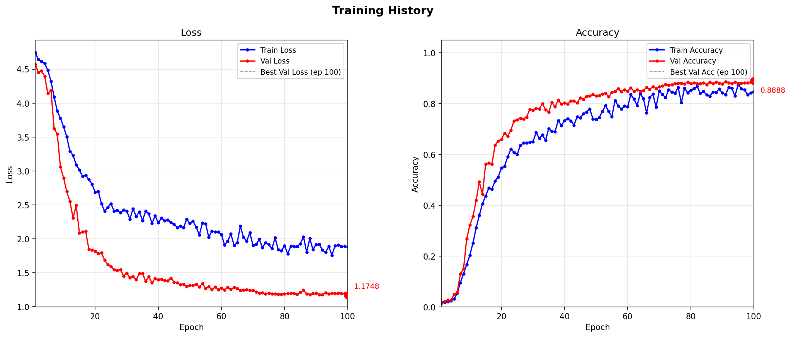

# Radar-Based Italian Sign Language Recognition

An approach provided for the **2nd Multimodal Isolated Italian Sign Language (LIS) Recognition Challenge** using Radar Range-Time Map (RTM) data.

The model classifies **126 isolated LIS gestures** from 3-antenna radar RTM signals using a hybrid CNN + Transformer architecture with advanced data augmentation and Stochastic Weight Averaging (SWA).

---

## Table of Contents

- [Task Overview](#task-overview)
- [Model Architecture](#model-architecture)
- [Project Structure](#project-structure)
- [Configuration](#configuration)
- [Results](#results)
---

## Task Overview

- **Dataset**: MultiMeDaLIS — radar RTM sequences recorded with 3 antennas
- **Input**: 3 × `.npy` files per sample (`RTM1`, `RTM2`, `RTM3`), each a 2D range-time map in dB scale
- **Output**: class index in `[0, 125]` (126 gestures)

---

## Model Architecture

`RadarModel` (`model.py`) is a 3-stage hybrid network:

```
Input (12, T=64, R)
    │
    ▼
CNN Backbone  ──  4× ResidualConvBlock (12→48→96→192→384)
    │              each block: Conv2d + BN + GELU + residual + SEBlock + MaxPool
    ▼
RangeAttentionPool  ──  attention-weighted pooling over range dimension → (B, 384, T)
    │
    ▼
Positional Encoding + Transformer Encoder  ──  6 layers, 8 heads, d_model=384
    │
    ▼
TemporalAttentionPool  ──  attention-weighted pooling over time → (B, 384)
    │
    ▼
Linear Classifier  ──  384 → 126
```

---

## Project Structure

```
.
├── config.py        # All hyperparameters and paths
├── dataset.py       # RadarDataset with augmentation pipeline
├── model.py         # RadarModel (CNN + Transformer)
├── train.py         # Training loop with SWA
├── infer.py         # TTA inference and submission export
├── utils.py         # Data loaders, augmentation helpers, lr schedule, plotting
├── requirements.txt # Python dependencies
├── checkpoints/     # Saved model weights (.pth)
└── results/         # Training logs, plots, submission.csv
```

---

## Configuration

Key parameters in `config.py`:

| Parameter | Default | Description |
|-----------|---------|-------------|
| `NUM_CLASSES` | 126 | Number of gesture classes |
| `TARGET_T` | 64 | Fixed temporal length after cropping |
| `BATCH_SIZE` | 64 | Training batch size |
| `EPOCHS` | 100 | Total training epochs |
| `WARMUP_EPOCHS` | 10 | Linear LR warmup duration |
| `LR` | 5e-4 | Peak learning rate |
| `LR_MIN` | 1e-6 | Minimum LR (cosine end) |
| `WD` | 1e-2 | AdamW weight decay |
| `SWA_START` | 70 | Epoch to start SWA collection |
| `SWA_LR` | 5e-5 | Constant LR during SWA phase |
| `MIXUP_PHASE1_END` | 35 | Epoch where Phase 1 augmentation ends |
| `VALID_SPLIT` | 0.2 | Fraction of train data used for validation |
| `num_workers` | 4 | DataLoader worker processes |

---

## Results

- Validation accuracy applying SWA: increase from **0.8888** to **0.8925**
- Combined val+test leaderboard score after inference: **0.8817**
